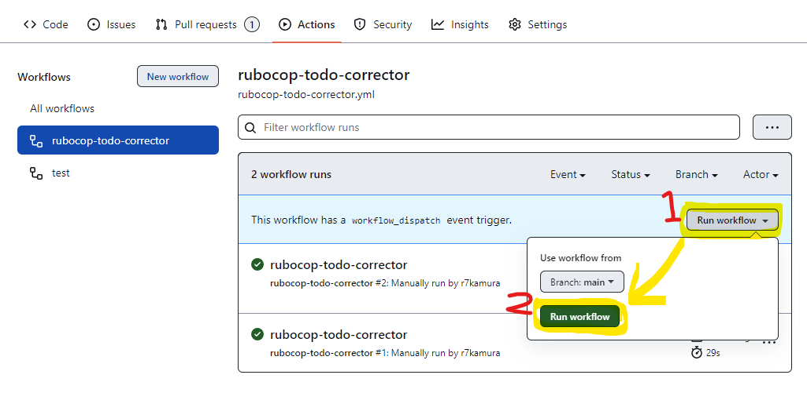
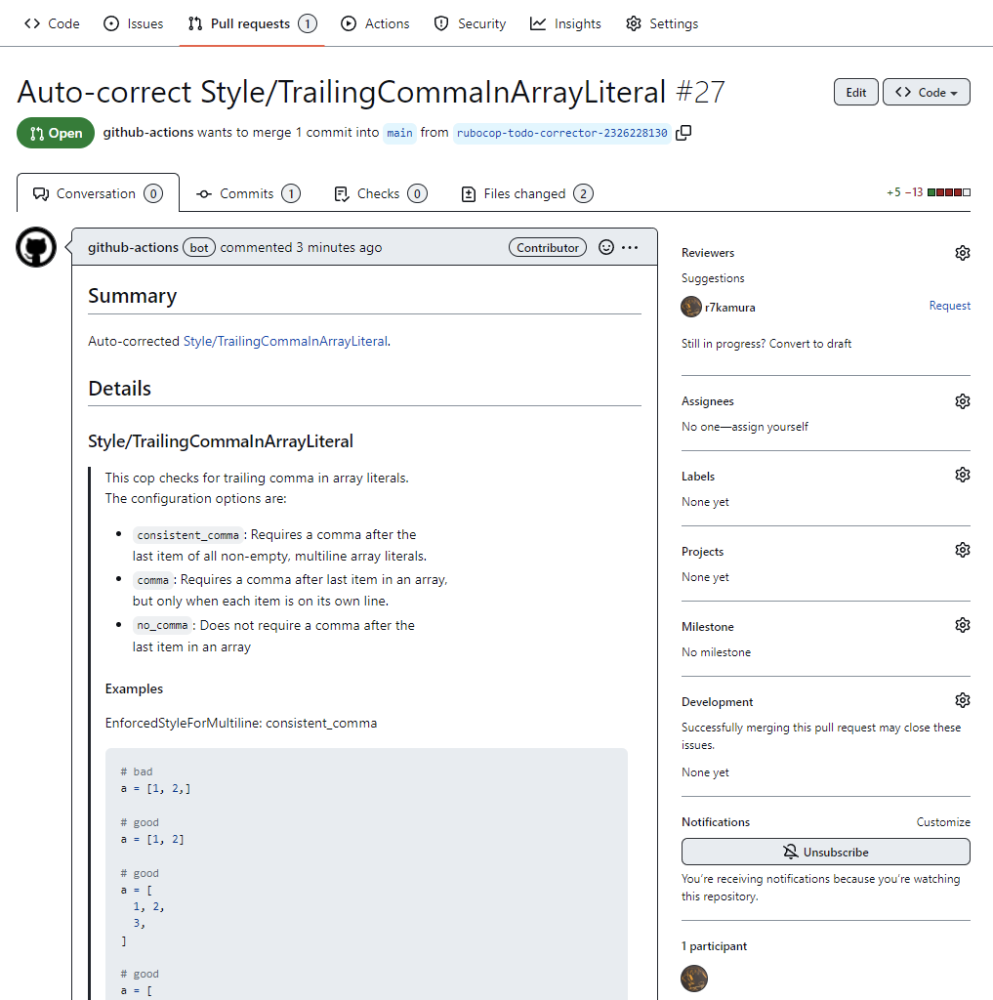
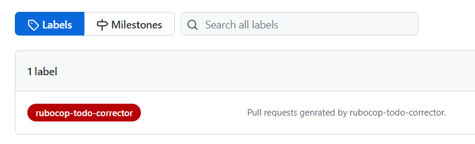

# rubocop-todo-corrector

[Custom action](https://docs.github.com/en//actions/creating-actions/about-custom-actions) to create a pull request that autocorrects offenses in .rubocop_todo.yml per cop.

## Usage

Add the following workflow file to manually run the action:

```yaml
# .github/workflows/rubocop-todo-corrector.yml
name: rubocop-todo-corrector

on:
  workflow_dispatch:

jobs:
  run:
    runs-on: ubuntu-latest
    steps:
      - uses: r7kamura/rubocop-todo-corrector@v0
```

Now you can run it via actions page:



or if you want to do it from CLI, use [GitHub CLI](https://cli.github.com/) like this:

```
gh workflow run rubocop-todo-corrector
```

After the action is complete, a pull request is created as follows:



## Automatic running

By adding `on.pull_request` event to the workflow, you can automatically run it when all other labeled pull requests are merged or closed.

```diff
 name: rubocop-todo-corrector

 on:
+  pull_request:
+     types:
+       - closed
   workflow_dispatch:
     inputs:
       cop_name:
         description: Pass cop name if you want to pick a specific cop.
         required: false
         type: string
       ignore:
         description: Check this with cop_name if you want to ignore a specific cop.
         required: false
         type: boolean
 jobs:
   run:
     runs-on: ubuntu-latest
     steps:
       - uses: r7kamura/rubocop-todo-corrector@v0
         with:
           ignore: ${{ inputs.ignore }}
+          label: rubocop-todo-corrector
```

Note that the `label` input is required to use this feature.

**Don't forget to create the label** on your repository before you run the action.



## Ignore cops

If you pass `ignore` as `"true"`, the action will create a pull request that ignores the specified cop by appending specified `cop_name` to `.rubocop_todo_corrector_ignore`.

Note: You can ignore specific cops by adding a file named `.rubocop_todo_corrector_ignore` to your repository. See the following page for more details:

- https://github.com/r7kamura/rubocop_todo_corrector#rubocop_todo_corrector_ignore

## Inputs

### `auto_merge`

- Pass `"true"` if you want it to run `gh pr merge --auto --merge` after creating a pull request.
- optional

### `cop_name`

- Pass cop name if you want to pick a specific cop.
- optional
    - Required if `ignore` is `"true"`
- e.g. `"Style/NegatedIf"`

### `gh_pr_create_options`

- Additional options for `gh pr create` command.
- optional
- e.g. `"--reviewer r7kamura --draft"`

### `github_token`

- GitHub access token for GitHub API calls.
- optional

It uses the default GitHub access token, so it usually works well as is without any additional configuration. However, there is a known issue that the default access token does not have `workflow` scope, so the pull request created by this action cannot run other GitHub Actions workflows. In that case, pass a custom access token with this option:

If a personal access token is used, the permission would look like this:

- repo
- workflow

If you use GitHub App to generate access tokens, the permission would look like this:

- Actions: Read/Write
- Contents: Read/Write
- Issues: Read (necessary for [GitHub API permission bug](https://github.com/cli/cli/issues/5986))
- Members: Read (optional for reviewer assignment)
- Pull Requests: Read/Write

### `ignore`

- Pass `"true"` if you want to create a pull request to ignore a specific cop instead.
- optional

### `label`

- Pull request label name.
- optional
- e.g. `"rubocop-todo-corrector"`
- Note: You need to create a label with this name on your repository.

### `mode`

- Mode to select autocorrected cop.
- default: `"random"`
- Choose from the following options:
  - `"first"`
  - `"last"`
  - `"least_occurred"`
  - `"most_occurred"`
  - `"random"`

### `only_safe`

- Pass `"false"` if you want it to include unsafe autocorrection.
- optional

### `working_directory`

- Specify working directory.
- optional
- default: `"."`

## Example

The below example is how we use this in our company:

```yaml
on:
  pull_request:
    types:
      - closed
  workflow_dispatch:
    inputs:
      cop_name:
        description: Pass cop name if you want to pick a specific cop.
        required: false
        type: string
      ignore:
        description: Check this with cop_name if you want to ignore a specific cop.
        required: false
        type: boolean

jobs:
  run:
    runs-on: ubuntu-latest
    steps:
      - uses: tibdex/github-app-token@v1
        with:
          app_id: ${{ secrets.OUR_GITHUB_APP_ID }}
          private_key: ${{ secrets.OUR_GITHUB_APP_PRIVATE_KEY }}
        id: github_app_token
      - uses: r7kamura/rubocop-todo-corrector@v0
        with:
          cop_name: ${{ inputs.cop_name }}
          gh_pr_create_options: "--reviewer our-org/rubocop-reviewers"
          github_token: ${{ steps.github_app_token.outputs.token }}
          ignore: ${{ inputs.ignore }}
          label: rubocop-todo-corrector
```
